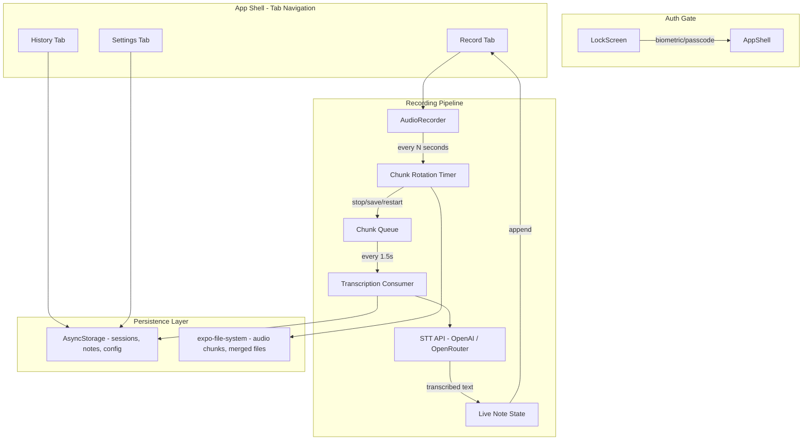
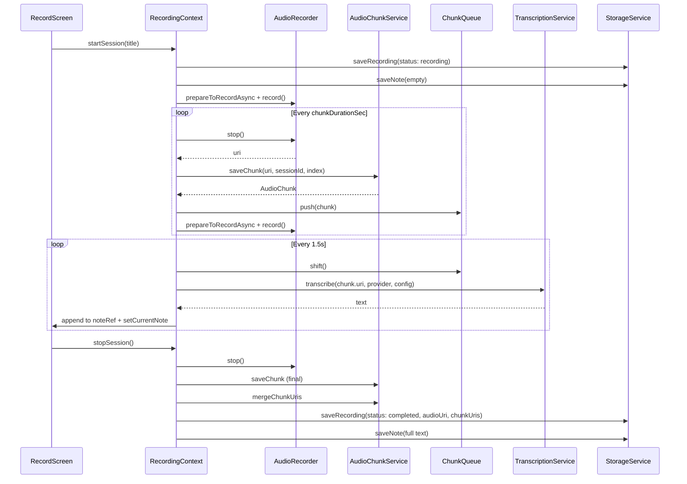

# AGENT.md — Realtime Note Taker

## Overview

A local-first, real-time meeting note-taker for Android and iOS. Records audio, chunks it into configurable segments, sends chunks to a speech-to-text API, and displays transcribed text in an append-only live notepad. All data stays on-device (AsyncStorage + filesystem). Authentication uses device-level biometrics/passcode — no cloud accounts.

## Tech Stack

| Layer | Technology |
|-------|-----------|
| Framework | Expo SDK 52, React Native 0.76.9 |
| Routing | Expo Router 4 (file-based, tab navigation) |
| Language | TypeScript 5.3 |
| Styling | NativeWind 4.1.23 (Tailwind CSS for RN) |
| Audio | expo-audio 0.3.5 (`useAudioRecorder`, `useAudioPlayer`) |
| Filesystem | expo-file-system 18.0.12 (legacy API) |
| Auth | expo-local-authentication (Face ID / Touch ID / fingerprint / passcode) |
| HTTP | axios 1.x (Metro resolves to browser bundle via `metro.config.js`) |
| Storage | @react-native-async-storage/async-storage |
| Icons | lucide-react-native |
| Fonts | @expo-google-fonts/figtree |
| Build | EAS Build (development, preview, production profiles) |

## Architecture

### High-Level Data Flow



### Recording Pipeline Detail



The pipeline uses a **producer-consumer pattern**:
- **Producer**: A `setInterval` timer fires every `chunkDurationSec` seconds, stops the recorder, saves the chunk to disk, and restarts recording.
- **Consumer**: A separate `setInterval` (1.5s) dequeues chunks and sends them to the STT API.
- **Refs over state**: `sessionIdRef`, `isRecordingRef`, `isPausedRef`, `isRotatingRef`, `noteRef`, `configRef` — all use `useRef` to avoid stale closures captured by `setInterval` callbacks.
- **Early persistence**: The session is saved to AsyncStorage at `startSession` time with `status: "recording"` so it appears in history immediately, even if `stopSession` fails.

### Pause/Resume

Pause clears the rotation and elapsed timers, waits for any in-flight chunk rotation to finish (`isRotatingRef`), then calls `recorder.pause()` with a fallback to `recorder.stop()`. Resume re-prepares the recorder and restarts timers.

## File Structure

```
realtime-note-taker/
├── app/                          # Expo Router file-based routes
│   ├── _layout.tsx               # Root layout: font loading, AuthProvider, AuthGate
│   ├── index.tsx                 # Redirect to /(app)
│   └── (app)/                    # Authenticated tab group
│       ├── _layout.tsx           # Tab navigator (Record, History, Settings)
│       ├── index.tsx             # Record screen (mic/pause/stop, live transcript)
│       ├── history.tsx           # Session list with pull-to-refresh
│       ├── settings.tsx          # Provider config, chunk duration, lock app
│       └── session/[id].tsx      # Session detail: audio playback + transcript
│
├── context/
│   ├── AuthContext.tsx            # Device-level biometric/passcode auth
│   └── RecordingContext.tsx       # Recording pipeline orchestrator (the core)
│
├── services/
│   ├── audioChunkService.ts      # File ops: save/merge/cleanup chunks (legacy FS API)
│   ├── storageService.ts         # AsyncStorage CRUD for sessions, notes, config
│   └── transcriptionService.ts   # Provider-based STT (OpenAI, OpenRouter) via axios
│
├── types/
│   ├── recording.ts              # RecordingSession, Note, AudioChunk, TranscriptionConfig
│   └── transcriptionProvider.ts  # ITranscriptionProvider, PROVIDER_REGISTRY
│
├── components/
│   ├── Button.tsx                # Reusable themed button
│   └── LoadingScreen.tsx         # Full-screen spinner
│
├── constants/
│   └── colors.ts                 # Semantic color tokens (warm stone palette)
│
├── utils/
│   └── errorHandling.ts          # Error categorization helpers
│
├── metro.config.js               # NativeWind + axios browser bundle override
├── tailwind.config.js            # Theme colors + Figtree font families
├── app.json                      # Expo config, plugins, permissions
├── eas.json                      # EAS Build profiles (dev, preview, prod)
└── babel.config.js               # babel-preset-expo + nativewind/babel
```

## Key Design Decisions

1. **Legacy expo-file-system API**: `expo-file-system@18.0.12` (SDK 52) exports `File`/`Directory`/`Paths` only from `expo-file-system/next`, which has no TypeScript declarations. The main entry exports the legacy promise-based API (`getInfoAsync`, `copyAsync`, `makeDirectoryAsync`, etc.). All file operations use the legacy API for reliability.

2. **axios with Metro browser override**: `axios@1.x` ships a Node.js bundle as `main` that imports `crypto`, `url`, etc. Metro is configured to resolve `axios` to `dist/browser/axios.cjs` (the browser bundle) via a custom `resolveRequest` in `metro.config.js`.

3. **Local device auth, not SaaS**: Uses `expo-local-authentication` for Face ID / Touch ID / fingerprint / device passcode. No user accounts, no cloud auth. If the device has no biometrics enrolled, the app skips auth entirely.

4. **AsyncStorage for metadata**: Sessions, notes, and transcription config are stored as JSON in AsyncStorage. Audio files live on the filesystem under `documentDirectory`.

5. **NativeWind pinned to 4.1.23**: Version 4.2.x pulls in `react-native-css-interop@0.2.1` which requires `react-native-worklets` (incompatible with RN 0.76). Pinned to 4.1.23 which uses `react-native-css-interop@0.1.22` and `react-native-reanimated/plugin` instead.

6. **Transcription provider abstraction**: `ITranscriptionProvider` interface with a `PROVIDER_REGISTRY` allows switching between OpenAI and OpenRouter. Both use OpenAI-compatible multipart endpoints.

## Pending Items

### High Priority

- [ ] **Audio merging is MVP-only**: `mergeChunkUris` copies only the last chunk as the "merged" file. A production app needs native audio concatenation (FFmpeg via a native module, or server-side merging). All chunk URIs are stored in `chunkUris[]` as a fallback.

- [ ] **Sequential chunk playback**: Session detail plays a single audio file. Should implement sequential playback across all chunks to play the full recording.

- [ ] **ANDROID_HOME not set in shell**: The user's environment is missing `export ANDROID_HOME=~/Library/Android/sdk` in `~/.zshrc`. Gradle builds fail without it. Needs to be set permanently.

- [ ] **Delete session from history**: No UI to delete recordings. `StorageService.deleteRecording` and `deleteNote` exist but are not wired to any UI. Should add swipe-to-delete or a delete button on the session detail screen, and also delete associated audio files from the filesystem.

### Medium Priority

- [ ] **Dark mode support**: Color tokens in `constants/colors.ts` are light-mode only. The `globals.css` from the original design has `.dark` variants. `app.json` has `"userInterfaceStyle": "automatic"` but no dark theme is applied.

- [ ] **Tests are stale**: `app/__tests__/_layout.test.tsx` and `components/__tests__/Button.test.tsx` were written for the original auth flow and may not match the current code. Need updating or rewriting.

- [ ] **Background recording**: `app.json` has `UIBackgroundModes: ["audio"]` for iOS but `expo-audio` config plugin does not set `enableBackgroundRecording: true`. Android background recording requires foreground service permissions (`FOREGROUND_SERVICE_MICROPHONE`, `POST_NOTIFICATIONS`) that are not declared.

- [ ] **Error feedback to user**: Transcription errors are logged to console but not surfaced in the UI. If the API key is missing or invalid, the user sees no feedback — just an empty transcript.

- [ ] **Notifications setting is non-functional**: The notifications toggle in settings is local state only (`useState(true)`) with no persistence or actual notification logic.

### Low Priority

- [ ] **Chunk duration change during recording**: Changing chunk duration in settings while a session is active won't take effect until the next session (timers use `configRef` at start time). This is acceptable but should be documented or the setting should be disabled during recording.

- [ ] **Search/filter in history**: No way to search recordings by title or filter by date. FlatList loads all sessions at once.

- [ ] **Export functionality**: No way to export transcripts (share as text, copy to clipboard) or audio files.

- [ ] **Accessibility**: No `accessibilityLabel` or `accessibilityRole` props on interactive elements.

- [ ] **App icon and splash screen**: Using default Expo placeholder assets. Need branded icon and splash.
